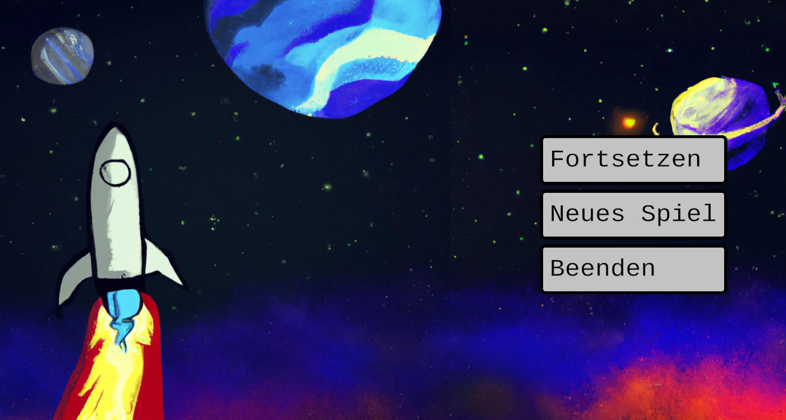
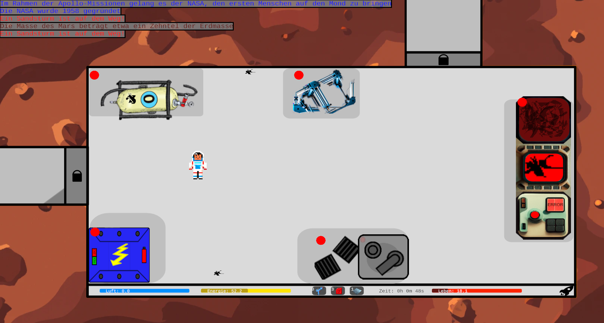
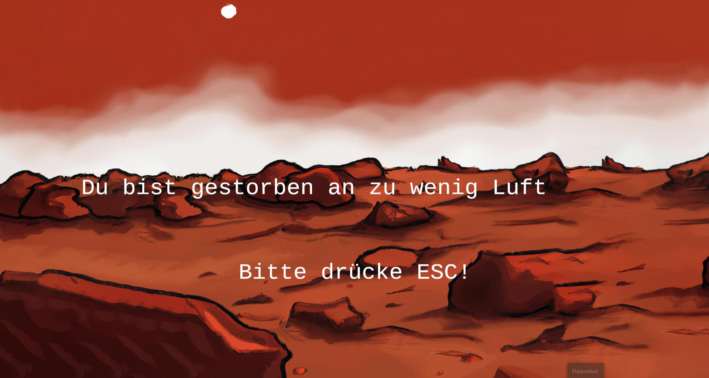

# Red Life
[](https://github.com/red-life-project/red-life/actions/workflows/rust.yml)

Red Life is a small game about an astronaut who is trying to survive in the hostile environment of Mars.

## Running the game
If you just want to play the game, you can download the latest release from
[here](https://github.com/red-life-project/red-life/releases).

To build the game from source, you need to have [Rust](https://rustup.rs) installed. Then, run the following command in
the root directory of the project:
```bash
rustup install nightly
rustup override set nightly
cargo run --release
```

## License
Red Life is licensed under the [GPLv3](https://www.gnu.org/licenses/gpl-3.0.en.html) license.
## Pictures

### Main menu



### Gameplay



### Death-screen




